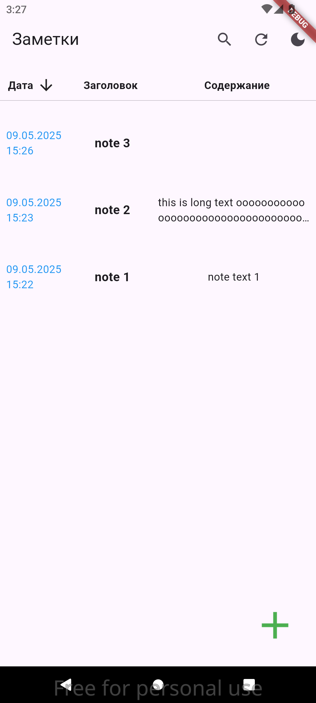

# text_notes

Text notes app

## Описание

Text Notes — это приложение для создания и управления текстовыми заметками. Оно разработано с использованием Flutter и поддерживает несколько платформ, включая Android, iOS, Windows, macOS, Linux и Web.

## Функциональность

- Создание, редактирование и удаление текстовых заметок.
- Организация заметок по категориям.
- Поиск заметок.
- Синхронизация данных между устройствами (в разработке).

## Установка

1. Убедитесь, что у вас установлен Flutter. Инструкции по установке можно найти [здесь](https://docs.flutter.dev/get-started/install).
2. Клонируйте репозиторий:
   ```bash
   git clone <URL репозитория>
   ```
3. Перейдите в папку проекта:
   ```bash
   cd text_notes
   ```
4. Установите зависимости:
   ```bash
   flutter pub get
   ```
5. Запустите приложение:
   ```bash
   flutter run
   ```

## Структура проекта

- `lib/` — Основной код приложения.
  - `core/` — DI и общие утилиты.
  - `data/` — DTO и репозитории для работы с данными.
  - `domain/` — Модели и интерфейсы доменного уровня.
  - `ui/` — Блоки, страницы и провайдеры для пользовательского интерфейса.
- `test/` — Тесты.
- `android/`, `ios/`, `linux/`, `macos/`, `windows/`, `web/` — Платформо-специфичные файлы.

## Скриншоты

Вот несколько скриншотов приложения:

### Список заметок (сортировка по возрастанию)


### Список заметок (сортировка по убыванию)



### Поиск заметок


### Список заметок (тёмная тема)


### Форма создания заметки


